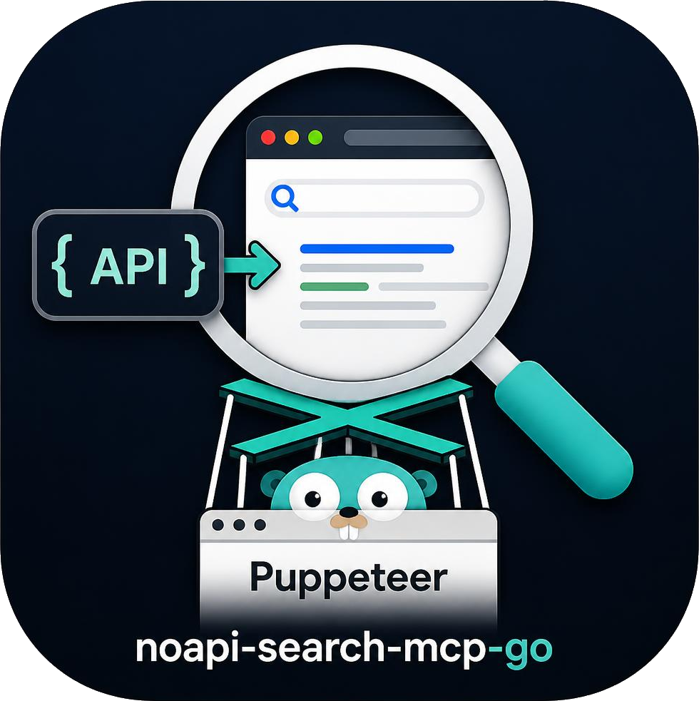

# noapi-search-mcp

Real search results and real web pages for a model, with no API keys.



It drives a headless browser and reads search engines' own HTML endpoints, so
there is no key to obtain, no quota, and no per-call cost.
Twenty-one tools: general web search across six engines, patent search,
Google's verticals for news, scholar, books, shopping and images, geocoding,
place search and directions, the weather, finance, translation and travel
cards, reverse image search, and a page reader that renders in a real browser
before extracting the text.

Everything is served twice, from one set of definitions:

- **As MCP tools**, over revision `2026-07-28` - the stateless one, with no
  initialize handshake and no session id. The older initialize-based revisions
  (`2025-03-26` through `2025-11-25`) are still answered, so existing clients
  keep working.
- **As an OpenAPI 3.1 HTTP API**, with Swagger UI compiled into the binary. For
  anything that does not speak MCP: a script, a service, a person with curl.

One Go binary, no runtime, no Python.

---

## Quick start

```sh
# Linux
curl -fsSL https://raw.githubusercontent.com/chriswirz/noapi-search-mcp-go/main/install.sh | sh

# or build it
go build -o noapi-search-mcp .
```

Three of the six engines need no browser at all, so this works immediately:

```sh
noapi-search-mcp --transport http &
curl -X POST http://127.0.0.1:8780/api/v1/search \
  -H 'Content-Type: application/json' \
  -d '{"query":"model context protocol","engine":"duckduckgo","num_results":3}'
```

Then open <http://127.0.0.1:8780/docs> for Swagger UI.

For the Google, Brave and Startpage engines - and for everything that reads a
Google page, which is most of the tool list - a browser is needed once:

```sh
go run github.com/playwright-community/playwright-go/cmd/playwright@latest \
  install --with-deps chromium
```

Or point it at a Chrome you already have: `--channel chrome`.

### As an MCP server

```json
{
  "mcpServers": {
    "search": {
      "command": "noapi-search-mcp"
    }
  }
}
```

That is the whole configuration. It speaks stdio by default, starts the browser
on the first call that needs one, and closes it again after five idle minutes.

---

## The tools

### Search

| Tool | What it does |
|------|--------------|
| `web_search` | The general one. Takes an `engine`: `google` (default), `duckduckgo`, `bing`, `brave`, `startpage`, `mojeek`. Supports `site:`, time filters, paging, language and region. |
| `google_search` | `web_search` pinned to Google. Kept because it is the name existing client configs use. |
| `visit_page` | Fetch a URL and return its readable text, rendered in a browser first so pages that build themselves in script still work. Optionally returns the page's links. |

### Google's verticals

| Tool | What it does |
|------|--------------|
| `google_news` | Headlines with source, age and snippet. |
| `google_scholar` | Papers with authors, venue and citation counts. |
| `google_books` | Books with authors and ISBNs where shown. |
| `google_shopping` | Products with prices, stores and ratings. |
| `google_images` | Image URLs with the pages they came from. |

### Patents

| Tool | What it does |
|------|--------------|
| `google_patents` | Search Google Patents by subject, inventor, assignee, jurisdiction, status and date. Returns publication numbers, abstracts, all four dates, and links to the patent and its PDF. Reads Google's own JSON endpoint, so it needs no browser and is the most reliable search here. |

### Places

| Tool | What it does |
|------|--------------|
| `geocode` | An address or place name to latitude and longitude, with the address Google matched and a confidence. |
| `google_maps` | Place search - restaurants, shops, services - with coordinates, rating, category and address for each. |
| `google_maps_directions` | Route between two places: distance, duration, summary and turns. Driving, walking, transit or cycling. |

### Answer cards

| Tool | What it does |
|------|--------------|
| `google_weather` | Current conditions and forecast, in both scales. |
| `google_finance` | Share price, change and key statistics. |
| `google_translate` | Translate between languages. |
| `google_trends` | Related topics and queries for a subject. |
| `google_flights` | Flight options and prices. |
| `google_hotels` | Hotels, nightly prices and ratings. |

### Images

| Tool | What it does |
|------|--------------|
| `google_lens` | Reverse image search: identify a photo, or find where else it appears. Takes a URL or a local file. |
| `list_images` | List image files in a directory, to feed to `google_lens`. |

### Downloads

| Tool | What it does |
|------|--------------|
| `download_asset` | Fetch a file - a patent PDF, an image, a document a result linked to - and keep it, served back from this server under a stable URL. |
| `list_downloads` | What is being held, with each file's URL and where it came from. |
| `delete_download` | Remove one. Nothing is deleted automatically. |

Stored files are served under the **MCP endpoint's own path** -
`/mcp/downloads/<id>` by default - so they ride along with the address a client
already has, and are reachable through the tunnel with nothing else to arrange.

The searches hand back links, and a link is not always enough: the thing that
wants the file may have no network of its own, or the URL may be signed and
about to expire. This fetches it once and gives you an address that keeps
working.

Three things it does deliberately, because hosting somebody else's files is
where a scraper turns into a file host:

- **Private destinations are refused.** Fetching a URL a caller chose is a
  request made from where this server sits, and then serving the result back
  makes that reach readable - localhost, the LAN, `169.254.169.254` handing out
  cloud credentials. Redirects are checked at every hop, not just the first.
  `downloads.allow_private_hosts` opts in for an intranet.
- **Nothing stored can execute.** Files are served `nosniff`, under a
  `default-src 'none'` policy, and only images, PDFs and plain text are shown
  inline - everything else, HTML and SVG included, is an attachment. A stored
  HTML file rendered inline would be script on this server's origin.
- **Both the file and the store are bounded**, and a full store is *refused*
  rather than pruned. These are files somebody asked for by name; deleting the
  oldest to make room for the newest would be quietly throwing away their data.

Paths are unguessable (128 random bits), and the token is required by default.
Set `downloads.public` to serve them openly when the point is to hand the URL
to something that cannot set a header.

---

## Choosing an engine

The engines are not interchangeable, and the differences are the reason there
are six of them.

| Engine | Browser? | Worth using when |
|--------|----------|------------------|
| `google` | yes | You want the fullest results. Also the one that rate-limits scrapers. |
| `duckduckgo` | **no** | Google is blocked, or you want an answer fast. Server-rendered, rarely challenged, clean URLs. The best fallback. |
| `bing` | **no** | A second opinion from a different index, with no browser. |
| `mojeek` | **no*** | An independent crawler. When the others agree, they may only be agreeing about one index. |
| `brave` | yes | Another independent index, linking directly to results. |
| `startpage` | yes | Google's results without the tracking - the closest substitute when `google` is rate-limited. |

A tool that reports being blocked is not broken. Google rate-limits scrapers,
and the response is to wait, or to pass a different engine - not to retry
immediately.

**\*Mojeek is gated, once.** It puts unfamiliar traffic behind a proof-of-work
challenge that only a browser can complete, and remembers the pass in a cookie
for about a month. This server does not solve it - working around a site's
anti-bot measure is not something to automate. Open
<https://www.mojeek.com/search?q=test>, tick the box, and run with `--cdp`
pointed at that browser: the request then goes out from a session a person
already established. Without a browser, Mojeek says exactly that rather than
reporting an unexplained block.

**On headless browsers.** Brave and Startpage inspect the browser closely, and
Startpage in particular refuses a headless one outright. Run with `--headed` if
you need it. Google and Brave work headless because this server corrects the
user agent - see below.

**Or stop fighting it and attach to a real Chrome**, which is what
[`--cdp`](#attaching-to-a-chrome-you-are-already-using) is for. It is by far the
most effective answer to being blocked.

---

## The HTTP API

With `--transport http`, the same capabilities are served as ordinary HTTP
resources beside the MCP endpoint:

```
POST /api/v1/search              GET  /api/v1          the operation list
POST /api/v1/search/google       GET  /api/v1/health   status, no browser started
POST /api/v1/search/news         GET  /openapi.json    the spec
POST /api/v1/geocode             GET  /docs            Swagger UI
POST /api/v1/fetch
...one path per tool
```

Every operation is defined once, in Go, and that single definition becomes the
MCP tool schema *and* the OpenAPI request body *and* the handler. There is no
second implementation to drift, and a test fails if an operation is missing
from the spec.

Errors distinguish whose problem it is: `400` for something you can fix and
retry differently, `502` for a scrape that was blocked or a site that would not
load, `401` for a missing token.

```sh
curl -X POST http://127.0.0.1:8780/api/v1/geocode \
  -H 'Content-Type: application/json' \
  -d '{"address":"1600 Amphitheatre Parkway, Mountain View, CA"}'
```

```json
{
  "query": "1600 Amphitheatre Parkway, Mountain View, CA",
  "latitude": 37.4224864,
  "longitude": -122.0855962,
  "name": "Google Building 41",
  "address": "1600 Amphitheatre Pkwy, Mountain View, CA 94043",
  "confidence": "exact"
}
```

Read the matched address. Geocoding an ambiguous string succeeds just as
readily as geocoding an exact one, and `confidence` plus the matched address
are how you tell which happened.

### Swagger UI is embedded

The Swagger UI assets are compiled into the binary with `go:embed`. That is
deliberate rather than incidental: this runs on build agents, in containers
with no egress, and on laptops on trains, and documentation that only renders
when the machine can reach a CDN is missing exactly when someone is trying to
work out why nothing works. It costs about 1.6 MB.

---

## Attaching to a Chrome you are already using

Every fingerprint patch in this server is trying to make a fresh browser look
like one somebody uses. You can skip the argument entirely and point it at a
Chrome you actually use:

```sh
# Start Chrome with a debugging port and its own profile directory.
# The --user-data-dir is not optional: without it Chrome hands the command
# line to the already-running instance and never opens the port.
chrome.exe --remote-debugging-port=9222 --user-data-dir=C:\chrome-debug

# Then point the server at it.
noapi-search-mcp --cdp http://127.0.0.1:9222
```

On Linux, `google-chrome --remote-debugging-port=9222 --user-data-dir=/tmp/chrome-debug`.

The difference is not subtle. On one machine, the same compatibility check:

| | launched headless | attached to a real Chrome |
|---|---|---|
| ok | 10 | **14** |
| blocked | 5 | 1 |

Google, Startpage, the weather card, Google News and Google Patents all went
from refusing the request to answering it. Sign that browser into a Google
account and use it normally for a while, and it gets better still - the thing
being measured is whether the browser looks like a person's, and after a few
weeks of real use it is one.

**What it costs.** The tools drive a browser holding your real sessions, in
tabs beside your own. This server opens and closes only its own tabs and never
touches yours, applies no fingerprint patches (a real browser needs none, and
redefining `navigator.userAgent` in a context you are browsing in would be
rude), and never reads or writes your cookie jar. But the browser is shared,
and every page a tool visits is visited as you - including anywhere you are
signed in. Use a separate `--user-data-dir` if that matters, which also lets you
keep a "scraping" Chrome distinct from your everyday one.

**Do not put this behind an open tunnel.** Enabling the tunnel with no
`auth_token` is refused at startup for exactly this reason: a public URL that
drives a signed-in browser is not something to arrive at by accident. Set
`--token`, or `tunnel.allow_anonymous` if you truly mean it.

---

## Knowing when it breaks

Every tool here rests on an assumption about someone else's website, and those
assumptions break silently. A selector that stops matching returns an empty
result set, which is indistinguishable from a query that genuinely found
nothing - so a scraper can be broken for weeks while looking merely unlucky.

The compatibility harness is the answer to that. It runs a known query against
each service - ones with stable, obvious answers, since the Eiffel Tower has
not moved - and checks the shape of what comes back:

```sh
noapi-search-mcp --selftest              # everything
noapi-search-mcp --selftest search       # just the engines
noapi-search-mcp --selftest google       # just the Google-backed ones
noapi-search-mcp --list-checks           # what the names are
```

```
Compatibility check: 10 ok, 5 blocked, 0 broken  (32.7s)
Every service that answered returned data this server could read.

  ok      search:duckduckgo  duckduckgo
          answered, and the data was in the expected shape
          sample: Specification - Model Context Protocol -> https://modelcontextprotocol.io/...

  blocked search:google      google
          the search engine served a bot check instead of results...

  ok      geocode            maps.google.com
          sample: 48.85837, 2.29448 (Eiffel Tower)

  ok      directions         maps.google.com
          sample: 584 km / 6 hr 18 min via A9
```

Three outcomes, deliberately distinguished, because they call for opposite
responses:

- **ok** - the service answered and the data was well formed.
- **blocked** - the service refused this address. Rate limiting. Nothing is
  wrong with the code; wait, or use an engine that needs no browser.
- **broken** - the service answered normally and the extraction produced
  nothing or nonsense. This is the one that needs a code change, and the report
  names the assumption that stopped holding.

**`--selftest` exits non-zero only for `broken`.** That is the whole contract:
a check that went red every time Google throttled a CI runner would be silenced
within a week, and then be worth nothing on the day a selector actually breaks.

The checks are more than presence tests. Geocoding the Eiffel Tower is asserted
to land within a kilometre of it, which catches reading the map viewport centre
instead of the place. Berlin to Munich is asserted to be a plausible road
distance, which is what would have caught the travel mode being silently
ignored. The weather card is asserted to know which temperature scale it is
showing. Search results are asserted not to be click trackers.

It is also available as the `selftest` MCP tool and at `POST /api/v1/selftest`,
so a model that is getting empty results can find out for itself whether the
server is broken or merely throttled.

---

## Exposing it

### Authentication

```sh
noapi-search-mcp --transport http --token "$MCP_TOKEN"
# or keep it out of the process table and the config file:
noapi-search-mcp --transport http --token-env MCP_TOKEN
```

The token guards what can *act*: the MCP endpoint and every REST operation.
It does not guard the documentation - `/docs` and `/openapi.json` are served
openly, because they describe the API and cannot use it. Open the docs, choose
**Authorize**, enter the token once, and "Try it out" works; it is kept across
reloads.

That split is deliberate rather than lax. A browser cannot put an
`Authorization` header on a URL somebody pasted into it, so a protected docs
page is one that answers 401 to the only client it exists for - and the usual
way round that, a token in the query string, puts a credential into browser
history, proxy logs and every `Referer` the page emits. The page carries no
token either, so serving it openly discloses nothing.

Set `api.protect_docs` if the surface itself is worth not publishing - behind
the tunnel, say - and reach the docs with a client that can set headers.

### Through a tunnel

The same handler can be served on a public HTTPS URL through an
[https-tunnel](https://github.com/chriswirz/https-tunnel) server, in process,
with no port opened on this machine:

```sh
noapi-search-mcp --tunnel https://tunnel.example.com \
                 --tunnel-key "$TUNNEL_API_KEY" \
                 --token "$MCP_TOKEN"
```

The tunnel URL is public. Set a token. The session id is written back so a
restart reclaims the same URL, and `--public-url` puts that address into the
spec so Swagger UI aims at the URL a browser can actually reach.

---

## How it avoids being blocked

Scraping search engines means looking like a browser, and most of what gives a
scraper away is small and fixable.

**The user agent.** A headless Chromium introduces itself as
`HeadlessChrome/148.0.0.0`, on every request, in a header anyone can read. It
is the loudest signal there is. This server reads the real user agent out of
the running browser and removes exactly that one word, patching both the
request header and `navigator.userAgent` so the two cannot disagree. It does
not invent a string: a hardcoded user agent drifts from the binary it claims to
be, and a mismatch is a worse signal than the honest value it replaced. Fixing
this is what gets Google and Brave working headless.

**A persistent profile.** Cookies accumulate in `./profile` and are reloaded on
the next run, so Google sees a returning browser rather than a first-time
visitor. The Python server this one is modelled on launches a fresh browser per
call, which is a new visitor every single time.

**The usual patches.** `navigator.webdriver`, an empty plugins array,
`window.chrome`, Playwright's own globals, and a permissions query that
contradicts itself. Human-length pauses between load and interaction. None of
it is exotic; together it makes the browser unremarkable rather than
undetectable.

**Honest failure.** When a page comes back as a bot check, that is reported as
what it is, with the engines that need no browser named in the error. A block
reported as "no results" sends people looking for a bug that is not there.

---

## What it does about Google's link obfuscation

Google no longer puts destination URLs on its results page. Every link is
`/goto?url=<opaque blob>`, readable only by Google. A scraper that hands those
back is returning URLs a caller cannot store, compare or cite.

So the trackers are unwrapped. DuckDuckGo's and Bing's carry the destination in
the URL itself and are decoded locally, for nothing. Google's is opaque and is
resolved by asking Google where it goes and reading the `Location` header
without following it - done concurrently across a page of results, so it costs
one round trip rather than one per result in series. A result that could not be
unwrapped says so with `redirected: true` rather than presenting a google.com
link as though it were the answer.

Turn it off with `search.resolve_redirects: false` if you would rather have the
trackers.

---

## Configuration

Everything has a working default; `config.json` is optional. Copy
`config.example.json` to start from - it documents every key, and keys
beginning with `_` are treated as comments, so the notes can stay in the file.

```sh
noapi-search-mcp --help          # every flag
noapi-search-mcp --check         # validate config and print what would be served
```

The flags that matter most:

| Flag | |
|------|---|
| `--engine <name>` | Default engine for `web_search`. |
| `--headed` | Show the browser window. Gets Startpage working; useful for watching a scrape. |
| `--channel chrome` | Drive an installed Chrome instead of Playwright's Chromium. |
| `--profile <dir>` | Where cookies live. Keep it. |
| `--max-page-chars <n>` | Cap on `visit_page` output. `MAX_PAGE_CHARS` also works, as in the Python original. |
| `--transport http` | Serve HTTP instead of stdio. |
| `--token` / `--token-env` | Require a bearer token. |
| `--no-api` | Serve MCP only; no REST, no spec, no docs. |
| `--warm` | Start the browser at boot rather than on first use. |

### Sessions, and "session terminated"

The older initialize-based revisions carry a session id. It lives in memory, so
a restart forgets every session, and a session idle past
`server.session_timeout_seconds` (two hours) is dropped. A request carrying an
id this process does not know gets **404**, which is what the specification
requires: the client is then required to start a new session by sending a fresh
`initialize` with no session id.

A client that does not do that leaves its user looking at `session terminated`
with no way forward. If yours is one of them - Open WebUI, at the time of
writing - set:

```json
{ "server": { "session_recovery": true } }
```

An unknown session id is then adopted instead of refused. It is off unless you
ask for it, because the 404 is correct and the client is what is wrong. Nothing
is lost by adopting one: a session here holds an id, a version, the client's
name and two timestamps, and no authorisation - that is the bearer token, which
is checked on every request regardless. A session the client ended itself with
`DELETE` stays ended either way.

---

## Differences from the Python original

This is an independent Go implementation of the idea behind
[noapi-google-search-mcp](https://github.com/VincentKaufmann/noapi-google-search-mcp).
No code is shared. Where it differs:

**Added**

- Five engines besides Google, three of which need no browser.
- `geocode`, which returns coordinates for an address.
- `--cdp`, to attach to a Chrome you already use rather than launching one.
- `google_patents`, over Google Patents' JSON endpoint rather than its page.
- A compatibility harness (`--selftest`) that says whether a service changed or
  is merely throttling, which is otherwise the hardest thing to tell apart.
- Coordinates on every `google_maps` result.
- An OpenAPI 3.1 HTTP API with embedded Swagger UI.
- MCP revision `2026-07-28`, with the older revisions still served.
- Google `/goto?` link unwrapping, without which result URLs are unusable.
- One shared browser with a persistent profile, instead of a launch per call.
- A tunnel, TLS, and bearer-token authentication.

**Not carried over**

The Python tools that rest on Python-only ML stacks: Whisper transcription,
RapidOCR, the ONNX CAPTCHA solver, yt-dlp video handling, the RSS/SQLite feed
subscriptions, IMAP email, and S3 upload. Those are a different project rather
than a translation of this one. `google_lens_detect`, which needs OpenCV
contour detection, is also absent; `google_lens` itself is here.

**Fixed along the way**

Selectors the original still keys off had stopped matching - `div.g`, which
every Google scraper uses, matches nothing on the current results page. The
weather card's Celsius and Fahrenheit readings were swapped whenever Google
served an imperial card. `travelmode` in the Maps URL is ignored in the path
form, so asking for driving directions from Berlin to Munich silently returned
a train.

---

## Development

```sh
./build.sh                  # format, vet, test, build for this machine
./build.sh --all            # cross-compile every released target into dist/
./build.sh --selftest       # ...then check the live services still match
```

On Windows, `build.cmd` and `build.ps1` do the same thing with the same
switches (`build.cmd -All -Version 1.2.0`). All three stamp a version derived
from git into the binary, so `--version` says what produced it.

Or directly:

```sh
go test ./...     # no network: protocol, schemas and parsing, against fixed input
go vet ./...
gofmt -l .
```

The tests deliberately touch nothing external: parsing is covered against
captured responses, and the classification logic in the harness is covered with
probes whose outcomes are fixed. A test that fails when a shared CI address gets
rate-limited is a test people learn to ignore. Checking the live services is
what `--selftest` is for, and it is a separate, deliberate act.

Releases are built for Windows and Linux on amd64 and arm64, with `.deb` and
`.rpm` packages for Linux, by the GitHub Actions workflow in
`.github/workflows/release.yml`.

---

## License

MIT. See [LICENSE](LICENSE), which also credits the original.
